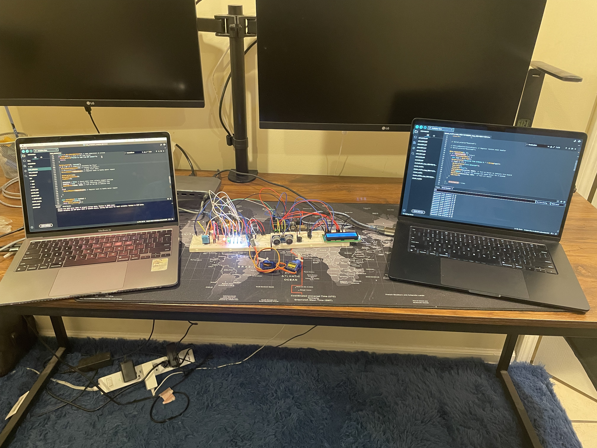
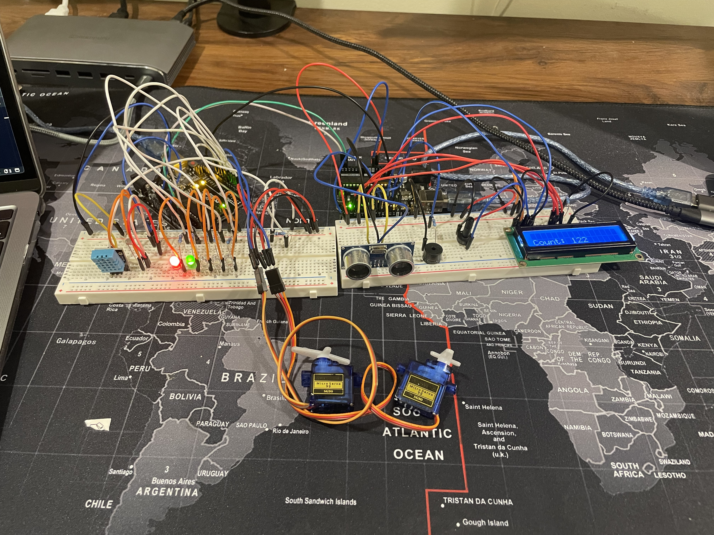
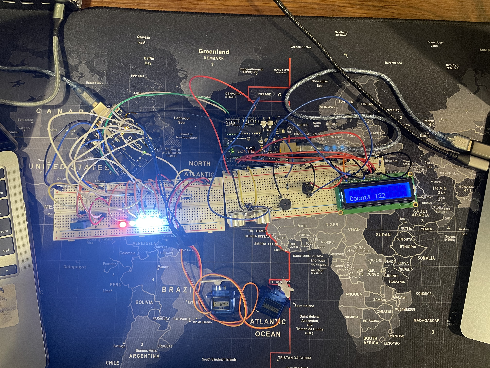

# ⚙️ **FactoryPlus - A Smart Conveyor Belt System**

FactoryPlus is an innovative **smart conveyor belt system** designed to enhance **safety**, **productivity**, and **automation** in factory environments. The system integrates dual Arduino boards and multiple sensors to ensure efficient, safe operations.

---

## 🖼 **Project Images**

---

## 🚀 **Introduction**

FactoryPlus leverages:
- Dual **Arduino Uno** boards
- A range of **sensors and actuators**
- Seamless **I2C communication**

to provide:

✅ **Real-time monitoring**  
✅ **Hazard detection**  
✅ **Intelligent conveyor operations**

---

## ✨ **Key Features**

🛡️ **Safety Monitoring**  
- Ultrasonic, temperature, humidity, and light sensors detect hazards.  
- Immediate response through buzzers and LEDs.

⚡ **Productivity Enhancement**  
- Tracks product counts.  
- Displays data and alerts via LCD.

📢 **Alert System**  
- Visual (LED) and auditory (buzzer) notifications.

🔗 **Smart Communication**  
- I2C protocol ensures reliable data sharing between Arduinos.

---

## 🔧 **Hardware Setup**

| Component | Quantity |
|------------|----------|
| Arduino Uno Boards | 2 |
| Ultrasonic Sensor | 1 |
| DHT11 Temp/Humidity Sensor | 1 |
| Servo Motors | 2 |
| LCD Screen | 1 |
| Piezo Speaker | 1 |
| LEDs (Red, Green, White) | 5 |
| Photoresistor | 1 |
| Breadboards | 2 |
| Resistors, Jumper Wires, USB Cables | Various |

---

### ⚡ **Wiring Overview**

#### Arduino 1:
- Ultrasonic: Trig to pin 9, Echo to pin 8  
- LCD: RS to 12, Enable to 11, D4-D7 to 5-2  
- Buzzer: pin 7  
- I2C: SDA A4, SCL A5  

#### Arduino 2:
- Servo Motors: pins 8, 9  
- DHT11: data pin 2  
- Photoresistor: A1  
- LEDs: Red 7, Green 6, White 5, 4, 3  
- I2C: SDA A4, SCL A5  

---

## 💻 **Software Development**

📦 Libraries Used:
- `LiquidCrystal.h` — LCD control  
- `DHT.h` — Temp & humidity readings  
- `Wire.h` — I2C communication  

---

## 📝 **User Guide**

### 🔌 **Setup**
- Position Arduinos so ultrasonic sensor faces servos.
- Keep 4-10 cm distance between motors and DHT11 sensor.

### ▶ **Operation**
- **Arduino 1:** Monitors hazards, triggers alerts.
- **Arduino 2:** Manages motors and LEDs based on incoming data.
- **I2C:** Synchronizes both boards for safety responses.

---

## 📅 **Timeline**

| Phase | Timeline |
|--------|----------|
| Setup & Initial Testing | 10/28/24 - 11/01/24 |
| Implementation & Integration | 11/04/24 - 11/29/24 |
| Final Adjustments & Presentation | 12/02/24 - 12/06/24 |

---

## 🔗 **References**

- [Arduino Official Docs](https://www.arduino.cc)  
- [I2C Communication Tutorial](https://www.arduino.cc/en/Tutorial/ArduinoMasterWriter)  
- [Servo Motor Guide](https://www.arduino.cc/en/Reference/Servo)  

For troubleshooting, visit [Arduino Forums](https://forum.arduino.cc/).

---

## 💡 **Future Enhancements**
🌟 **Cloud Integration:** Send data to a cloud dashboard  
🌟 **Predictive Maintenance:** AI-based alerts for machine wear  
🌟 **Wireless Communication:** Replace I2C with wireless modules  
🌟 **Energy Monitoring:** Track power consumption  

